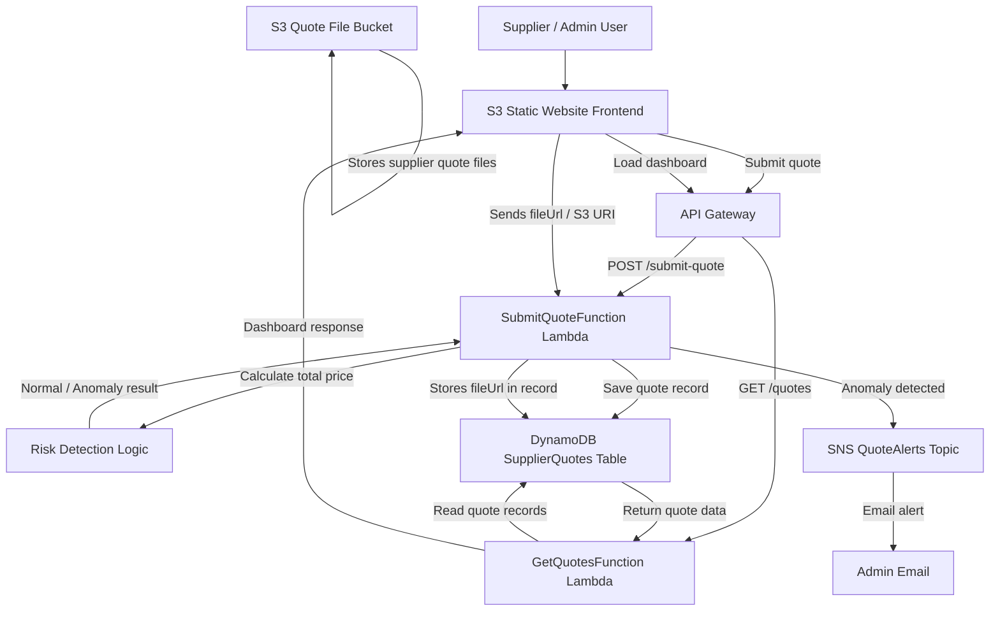

## System Architecture Diagram

```mermaid
flowchart TD
    A[Supplier / Admin User] --> B[S3 Static Website Frontend]

    B -->|Submit quote| C[API Gateway]
    C -->|POST /submit-quote| D[SubmitQuoteFunction Lambda]

    D -->|Calculate total price| E[Risk Detection Logic]
    E -->|Normal / Anomaly result| D

    D -->|Save quote record| F[DynamoDB SupplierQuotes Table]

    B -->|Load dashboard| C
    C -->|GET /quotes| G[GetQuotesFunction Lambda]
    G -->|Read quote records| F
    F -->|Return quote data| G
    G -->|Dashboard response| B

    H[S3 Quote File Bucket]
    B -->|Sends fileUrl / S3 URI| D
    H -->|Stores supplier quote files| H
    D -->|Stores fileUrl in record| F

    D -->|Anomaly detected| I[SNS QuoteAlerts Topic]
    I -->|Email alert| J[Admin Email]
```
